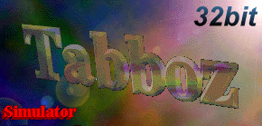

<div align="center">
  <a href="https://linzialessandro.github.io/Tabboz_mobile/" target="_blank"></a>
  <h1>Tabboz Simulator — Mobile Edition</h1>
  <p><em>Porting mobile-first del celebre simulatore di vita del tabbozzo milanese degli anni '90 / 2000</em></p>
</div>
<br/>

> [!NOTE]
> **Repository Sandbox**: Questo repository è un fork / sandbox di sviluppo per testare l'esperienza WebApp Mobile (PWA) prima di una futura Pull Request al [repository ufficiale upstream](https://github.com/andreax79/tabboz).
> L'emulatore desktop originale è creato e mantenuto da **Andrea Bonomi** ed **Emanuele Caccialanza** ed è giocabile all'indirizzo [andreax79.github.io/tabboz](https://andreax79.github.io/tabboz/).

## 📱 Mobile PWA (Gioca Online)

La versione Mobile è accessibile direttamente su:
👉 **[https://linzialessandro.github.io/Tabboz_mobile/](https://linzialessandro.github.io/Tabboz_mobile/)**

Mantiene intatto al 100% l'engine di gioco originale C/WebAssembly e la sua logica Win32, trasformando l'interfaccia in un'esperienza touch-friendly, fluida e installabile come Progressive Web App (PWA) con:
- Interfaccia ottimizzata per schermi verticali / smartphone
- Gestione salvataggi multi-slot su LocalStorage con export/import file `.tabboz`
- Supporto offline via Service Worker (network-first per il codice, cache-first per i media)
- Piena fedeltà a tutte le feature del gioco originale (Scuola, Negozi, Bar Tabacchi, Scooter, Tuning, Disco, Tipa, Famiglia, Compagnia)

La versione desktop originale di questo fork è in [`desktop.html`](desktop.html). L'architettura del layer mobile è descritta in [`mobile/README.md`](mobile/README.md).

### 🧪 Sviluppo locale

```shell
python3 server.py
```

Poi apri http://localhost:8080/mobile/ (PWA) oppure http://localhost:8080/desktop.html (emulatore originale).

Validazione salvataggi:

```shell
node mobile/js/save-manager.test.js
```

## 🖥️ Web development

<div align="center">
  <a href="https://andreax79.github.io/tabboz/" target="_blank"></a>
</div>
<br/>

### 📖 Prerequisites

In order to compile the project we need the following software installed on our development machine:
- Python >= 3.8
- [Emscripten](https://emscripten.org/)

### 📦 Builds

Build the project.

```shell
make build
```

We also have a script for updating dialogs used in the project, you only need to run this if you modify the `.rc` files:

```shell
make rc
```

### 🎨 Code linting

To fix the linting errors, use the following command:

```shell
make format
```

### 🚀 Links

- [Novantotto, A tool for porting Windows programs to WebAssembly](https://github.com/andreax79/novantotto)
- [Emscripten, A complete compiler toolchain to WebAssembly](https://emscripten.org/)
- [98.css, A design system for building faithful recreations of old UIs](https://github.com/jdan/98.css)

## ⚖️ LICENSE

[](https://www.gnu.org/licenses/gpl-3.0.en.html)

This fork remains distributed under GPL-3.0, as supplied in
[`LICENSE`](LICENSE). The mobile bridge adapts the original Novantotto bridge,
which is available under MPL-2.0; its source notice is retained in
[`mobile/js/win32-bridge.js`](mobile/js/win32-bridge.js). Original authorship
and the upstream project are credited throughout the source.
